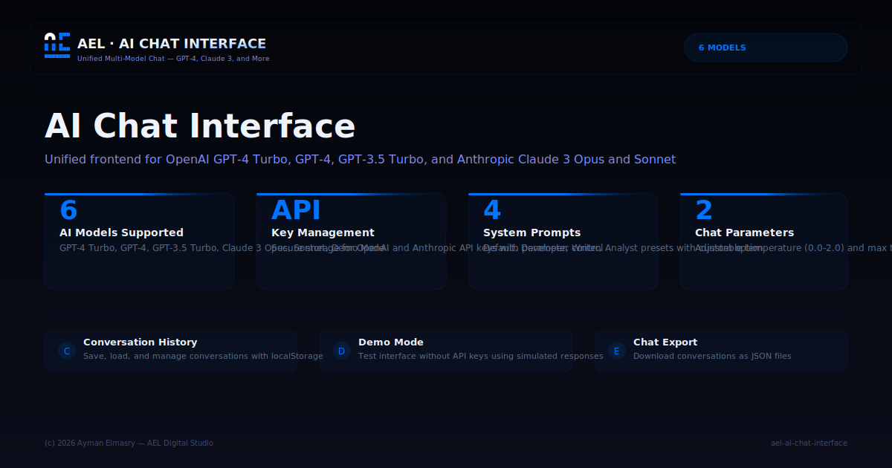

# AEL | AI Chat Interface — Unified Multi-Model Chat

> **A unified chat interface for multiple AI models** — OpenAI (GPT-4 Turbo, GPT-4, GPT-3.5 Turbo) and Anthropic (Claude 3 Opus, Claude 3 Sonnet) — plus a Demo Mode for testing without API keys.  
> Features conversation history, customizable system prompts, and full parameter control.  
> Built by Ayman Elmasry — AEL Digital Studio.

---

## Preview



---

## Table of Contents

- [Features](#features)
- [How It Works](#how-it-works)
- [Project Structure](#project-structure)
- [Getting Started](#getting-started)
- [Usage](#usage)
- [API Configuration](#api-configuration)
- [Technical Details](#technical-details)
- [Credits](#credits)

---

## Features

- **6 models** — GPT-4 Turbo, GPT-4, GPT-3.5 Turbo, Claude 3 Opus, Claude 3 Sonnet, Demo Mode
- **Conversation history** — save, load, and manage conversations with localStorage persistence
- **Custom system prompts** — presets included (Default, Developer, Writer, Analyst)
- **Parameter control** — adjustable temperature and max tokens
- **API key management** — secure storage for OpenAI and Anthropic keys
- **Chat export** — download conversations as JSON
- **Demo Mode** — test the interface without any API key
- **Glassmorphism UI** — dark theme with blue (#0074FF) accents

---

## How It Works

### Architecture

The interface acts as a unified frontend for multiple AI model APIs:

```
User Input → Chat Interface → API Router → OpenAI / Anthropic / Demo → Response → UI
```

### API Routing

| Model | Provider | Endpoint |
|-------|----------|----------|
| GPT-4 Turbo | OpenAI | `https://api.openai.com/v1/chat/completions` |
| GPT-4 | OpenAI | `https://api.openai.com/v1/chat/completions` |
| GPT-3.5 Turbo | OpenAI | `https://api.openai.com/v1/chat/completions` |
| Claude 3 Opus | Anthropic | `https://api.anthropic.com/v1/messages` |
| Claude 3 Sonnet | Anthropic | `https://api.anthropic.com/v1/messages` |
| Demo Mode | Built-in | Simulated responses (no API call) |

### Conversation Management

- Each conversation is stored as a JSON object with messages, model, parameters, and timestamp
- localStorage provides persistent storage across sessions
- Conversations can be loaded, continued, exported, or deleted

---

## Project Structure

```
ael-ai-chat-interface/
├── index.html              # HTML5 semantic structure
├── css/
│   └── style.css           # All styles (glassmorphism, dark theme)
├── js/
│   └── script.js           # Full JS engine (chat, API, storage, UI)
├── screenshot.svg          # Project preview image
├── .gitignore
└── README.md
```

This separation follows modern web best practices:
- **HTML5** — semantic elements
- **CSS3** — custom properties for theming, Flexbox/Grid layout
- **Vanilla JS (ES2020+)** — zero dependencies, Fetch API for network calls

---

## Getting Started

### Run Locally

```bash
git clone https://github.com/aymanelmasryael/ael-ai-chat-interface.git
cd ael-ai-chat-interface
open index.html
```

Or simply open `index.html` in any modern browser — no server required.

### Prerequisites

- A modern web browser (Chrome, Firefox, Safari, Edge)
- API keys for OpenAI and/or Anthropic (optional — Demo Mode works without keys)

---

## Usage

### Demo Mode (No API Key Required)
1. Open the app
2. Select **Demo Mode** from the model dropdown
3. Start chatting — responses are simulated

### Real AI Models (API Key Required)
1. Go to **Settings**
2. Enter your OpenAI and/or Anthropic API keys
3. Select your preferred model and adjust parameters (temperature, max tokens)
4. Click **Save Settings**
5. Start chatting with real AI responses

### Managing Conversations
- Chats are auto-saved in **History**
- Load previous conversations to continue them
- Export any chat as JSON
- Delete individual conversations or clear all data

---

## API Configuration

| Parameter | Description | Range |
|-----------|-------------|-------|
| Temperature | Response randomness | 0.0 – 2.0 |
| Max Tokens | Maximum response length | 100 – 4096 |
| System Prompt | AI behavior preset | Default, Developer, Writer, Analyst, Custom |

---

## Technical Details

| Aspect | Detail |
|--------|--------|
| Architecture | Static site (HTML5 + CSS3 + JS) |
| JavaScript | Vanilla ES2020+, Fetch API |
| CSS | Custom properties for theming |
| Icons | Font Awesome (CDN) |
| Data storage | localStorage for conversations and API keys |
| Browser support | Chrome, Firefox, Safari, Edge (modern versions) |

---

## Credits

**Created by:** Ayman Elmasry — AEL Digital Studio  
**Website:** [aymanelmasry.com](https://aymanelmasry.com)  
**Email:** [info@aymanelmasry.com](mailto:info@aymanelmasry.com)  
**License:** © 2026 Ayman Elmasry — AEL Digital Studio. All rights reserved.

### Connect

[LinkedIn](https://linkedin.com/in/aymanelmasryael) · [Instagram](https://instagram.com/aymanelmasryael) · [X](https://x.com/aymanelmasryael) · [CodePen](https://codepen.io/aymanelmasryael) · [GitHub](https://github.com/aymanelmasryael) · [Behance](https://behance.net/aymanelmasryael)

---

*AEL Prompt IP System v1.0 — Sovereign Identity Block*
